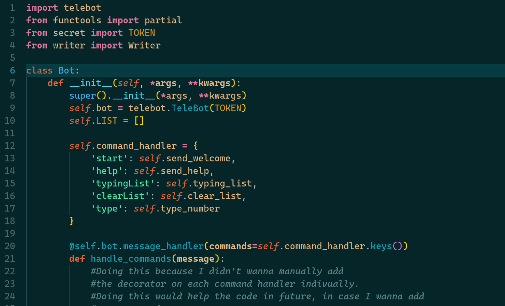

# Simulate Typing

Well, I was participating in a competition, and we had to write out code in Google Docs, but the thing being, we can't copy paste from our systems. That would lead to disqualification, so, I came up with this solution to save me a lot of time.

The Problem was to find a way to give commands to a python script from a phone, or some other device, so that the code can be written without making the desktop a kind of mess. The first and the instant solution that I thought of was to make a telegram bot.

The pytelegrambotapi gives us a very easy way to connect any device using telegram to this device. To make the code work, first install the requirements, given in requirements.txt, and then, replace the bot token from the secret.py which you can get from BotFather in telegram, and then simply run the bot.py file

//TODO: Make commands to edit the config of the writer class.
